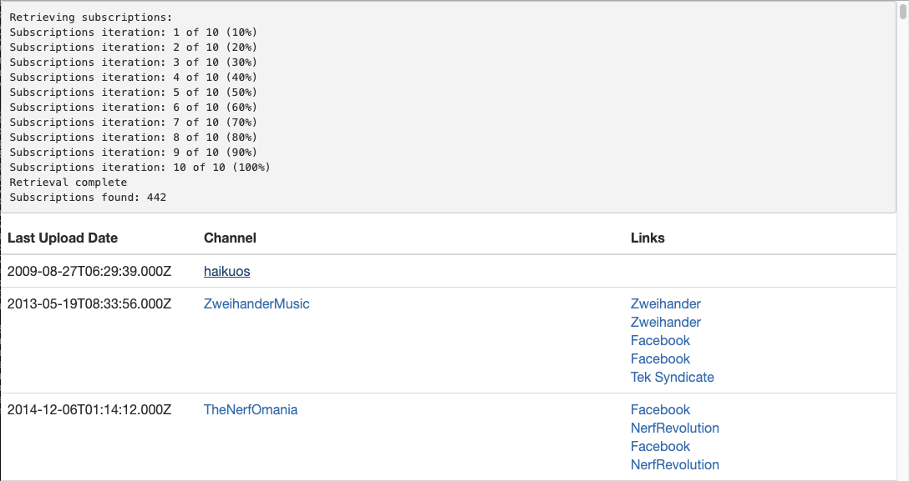

# youtube-tools
Python script to generate an HTML file listing out all YouTube subscriptions by last video upload date. _Now with links!_



### Configure client_secrets.json

https://cloud.google.com/life-sciences/docs/how-tos/getting-started#download_credentials_for_api_access

### Setup the Enviornment

```
pipenv install
```

### Run

```
pipenv run python youtube-tools.py > output.html
```
